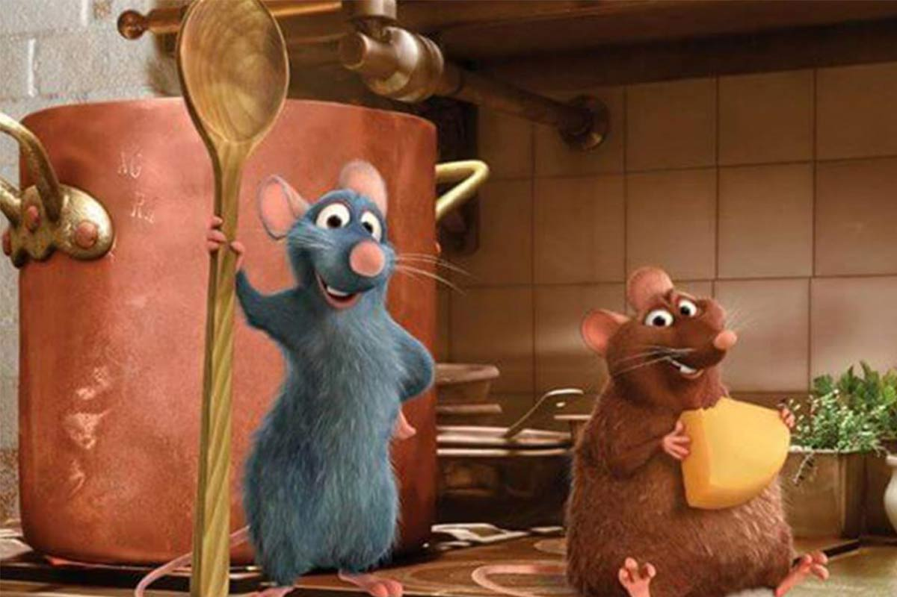

# Ratatouille

## Ejercicio integrador. Paradigma Lógico.

*"No cualquiera puede convertirse en un gran artista, pero un gran artista puede provenir de cualquier lado"*

¡Bonjour! En una ciudad donde ratas y humanos saben cocinar, tenemos la siguiente información en nuestra base de conocimiento:

~~~prolog
rata(remy, gusteaus).
rata(emile, bar).
rata(django, pizzeria).

cocina(linguini, ratatouille, 3).
cocina(linguini, sopa, 5). 
cocina(colette, salmonAsado, 9).
cocina(horst, ensaladaRusa, 8).
~~~

De las ratas sabemos su nombre y dónde viven. De los humanos, además de su nombre, qué platos saben cocinar y cuánta experiencia (del 1 al 10) tienen preparándolos. También tenemos información acerca de quién trabaja en cada restaurante:

~~~prolog
trabajaEn(gusteaus, linguini).
trabajaEn(gusteaus, colette).
trabajaEn(gusteaus, skinner).
trabajaEn(gusteaus, horst).
trabajaEn(cafeDes2Moulins, amelie).
~~~

Desarrollá los siguientes predicados, asegurando que sean completamente inversibles:

1. `inspeccionSatisfactoria/1`: se cumple para un restaurante cuando no viven ratas allí.

2. `chef/2`: relaciona un empleado con un restaurante si el empleado trabaja allí y sabe cocinar algún plato.

3. `chefcito/1`: se cumple para una rata si vive en el mismo restaurante donde trabaja linguini.

4. `cocinaBien/2`: es verdadero para una persona si su experiencia preparando ese plato es mayor a 7. Además, remy cocina bien cualquier plato que exista.

5. `encargadoDe/3`: nos dice el encargado de cocinar un plato en un restaurante, que es quien más experiencia tiene preparándolo en ese lugar.
Ahora conseguimos un poco más de información sobre los platos. Los dividimos en entradas, platos principales y postres:

~~~prolog
plato(ensaladaRusa, entrada([papa, zanahoria, arvejas, huevo, mayonesa])).
plato(bifeDeChorizo, principal(pure, 20)).
plato(frutillasConCrema, postre(265)).
~~~

De las entradas sabemos qué ingredientes las componen; de los principales, qué guarnición los acompaña y cuántos minutos de cocción precisan; y de los postres, cuántas calorías aportan.

6. `saludable/1`: un plato es saludable si tiene menos de 75 calorías.

* En las entradas, cada ingrediente suma 15 calorías.
* Los platos principales suman 5 calorías por cada minuto de cocción. Las guarniciones agregan a la cuenta total: las papasFritas 50 y el puré 20, mientras que la ensalada no aporta calorías.
* De los postres ya conocemos su cantidad de calorías. 

7. `criticaPositiva/2`: es verdadero para un restaurante si un crítico le escribe una reseña positiva. Cada crítico maneja su propio criterio, pero todos están de acuerdo en lo 
* **mismo**: el lugar debe tener una inspección satisfactoria.
* **antonEgo** espera, además, que en el lugar sean especialistas preparando ratatouille. Un restaurante es especialista en aquellos platos que todos sus chefs saben cocinar bien.
* **christophe**, que el restaurante tenga más de 3 chefs.
* **cormillot** requiere que todos los platos que saben cocinar los empleados del restaurante sean saludables y que a ninguna entrada le falte zanahoria.
* **gordonRamsey** no le da una crítica positiva a ningún restaurante.
